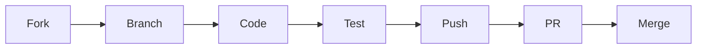

<div align="center">

# 🚀 Contributing to ClusterML

[](http://makeapullrequest.com)
[](#)
[](#)

**We're thrilled you want to contribute! Let's build something amazing together.**

[Getting Started](#-getting-started) •
[How to Contribute](#-how-to-contribute) •
[Project Structure](#-project-structure) •
[Guidelines](#-guidelines)

</div>

---

## 👋 Welcome!

Thank you for your interest in contributing to **ClusterML**! This project is built by a passionate team and is designed to be beginner-friendly for contributors who want to learn distributed systems and ML infrastructure.

> 💡 **New to open source?** No worries! We've got your back. Check out our [First Contributions Guide](https://github.com/firstcontributions/first-contributions) for a gentle introduction.

---

## 🎯 How to Contribute

<table>
<tr>
<td width="50%">

### 🐛 Bug Fixes
Found a bug? Help us squash it! Check our issues labeled `bug` or report a new one.

</td>
<td width="50%">

### 📚 Documentation
Improve our docs, fix typos, or add examples. Every bit helps!

</td>
</tr>
<tr>
<td width="50%">

### ✨ New Features
Have a cool idea? Open an issue to discuss it first, then submit a PR.

</td>
<td width="50%">

### ⚡ Performance
Help us make ClusterML faster and more efficient.

</td>
</tr>
<tr>
<td width="50%" colspan="2" align="center">

### 📝 Examples & Tutorials
Write tutorials, examples, or blog posts to help others learn.

</td>
</tr>
</table>

---

## 🏗️ Project Structure

```
ClusterML/
├── 🎛️  master/       → Orchestrator and scheduling logic
├── 👷  worker/       → Worker agent running on nodes
├── 💻  cli/          → Terminal interface
├── 📦  sdk/          → Python SDK
├── 🖥️  dashboard/    → Web UI (frontend & backend)
├── 📖  docs/         → Documentation
├── 📂  examples/     → Example jobs and tutorials
└── 🔧  scripts/      → Utility scripts
```

> ⚠️ **Tip:** Please work only in the folder related to your task to keep PRs focused and easy to review.

---

## 🔄 Contribution Workflow



### Step-by-Step Guide

<details>
<summary><b>1️⃣ Fork & Clone</b></summary>

```bash
# Fork the repo on GitHub, then clone your fork
git clone https://github.com/YOUR_USERNAME/clusterml.git
cd clusterml
```

</details>

<details>
<summary><b>2️⃣ Create a Branch</b></summary>

```bash
# Create a descriptive branch name
git checkout -b feature/awesome-feature
# or
git checkout -b fix/bug-description
```

</details>

<details>
<summary><b>3️⃣ Make Your Changes</b></summary>

- Write clean, readable code
- Follow existing code style
- Add comments where needed
- Update documentation if applicable

</details>

<details>
<summary><b>4️⃣ Test Your Changes</b></summary>

```bash
# Run tests to ensure nothing is broken
pytest tests/
```

</details>

<details>
<summary><b>5️⃣ Commit & Push</b></summary>

```bash
# Write a clear commit message
git add .
git commit -m "feat: add awesome feature"
git push origin feature/awesome-feature
```

</details>

<details>
<summary><b>6️⃣ Open a Pull Request</b></summary>

- Go to your fork on GitHub
- Click "Compare & pull request"
- Fill in the PR template
- Wait for review! 🎉

</details>

---

## 📋 Guidelines

### 💬 Commit Message Format

We follow [Conventional Commits](https://www.conventionalcommits.org/):

| Type          | Description                     |
| ------------- | ------------------------------- |
| `feat:`     | New feature                     |
| `fix:`      | Bug fix                         |
| `docs:`     | Documentation changes           |
| `style:`    | Code style changes (formatting) |
| `refactor:` | Code refactoring                |
| `test:`     | Adding or updating tests        |
| `chore:`    | Maintenance tasks               |

**Example:** `feat: add GPU resource monitoring to worker agent`

### ✅ Code Quality Checklist

- [ ] Code follows the project style
- [ ] Self-review completed
- [ ] Comments added for complex logic
- [ ] Tests added/updated
- [ ] Documentation updated
- [ ] No breaking changes (or documented)

---

## 🆘 Need Help?

<div align="center">

| Resource           | Link                                                    |
| ------------------ | ------------------------------------------------------- |
| 📖 Documentation   | [docs/](./docs/)                                           |
| 🐛 Report Bug      | [Open Issue](../../issues/new?template=bug_report.md)      |
| 💡 Feature Request | [Open Issue](../../issues/new?template=feature_request.md) |
| 💬 Discussions     | [GitHub Discussions](../../discussions)                    |

</div>

---

## 🙏 Thank You!

<div align="center">

**Every contribution matters, no matter how small!**

Your efforts help make ClusterML better for everyone.

⭐ **Star this repo** if you find it useful!

---

`<sub>`Made with ❤️ by the ClusterML community`</sub>`

</div>
